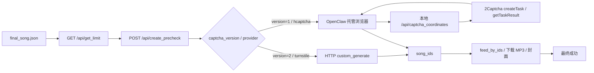

# 本地 Suno API：Create 验证说明

这份说明只讲一个核心问题：在本地 Suno API 的 `create` 关键环节，系统到底是怎么通过验证的。

给第一次接触这个任务的 Agent 看的时候，先记住一句话：

- `captcha_version=2` 走的是 Turnstile / HTTP 直提路径。
- `captcha_version=1` 走的是 OpenClaw 托管浏览器里的 hCaptcha 坐标路径。
- 本地 `captcha_coordinates` 接口本身也会调用 2Captcha。
- 真正的成功证据永远是 Suno 返回了 `song_ids`，不是 `ready`、不是 `challenge_detected=false`。

## 1. 这套系统分别在哪里

- 本地 Suno API 主工程：`<repo-root>`
- OpenClaw 托管浏览器 harness：`<workspace>/suno-create-web-cli/agent-harness`
- 微博热搜创作歌曲 Skill：`<user-home>/.codex/skills/codex-weibo-hot-song`

如果你只想判断 create 验证逻辑，重点看这几个文件：

- `<repo-root>/src/app/api/custom_generate/route.ts`
- `<repo-root>/src/app/api/captcha_coordinates/route.ts`
- `<repo-root>/src/lib/SunoApi.ts`
- `<workspace>/suno-create-web-cli/agent-harness/SUNO_CREATE.md`

## 2. 总体流程

## 3. 三种实际情况

| 情况 | 触发条件 | 谁在验证 | 是否调用 2Captcha | 真正的成功标准 |
|---|---|---|---|---|
| 无挑战 / 信任窗口 | `Create` 点击后没有出现 hCaptcha | 浏览器会话本身 | 否 | 只有拿到 `song_ids` 才算成功 |
| `captcha_version=2` / Turnstile | `create_precheck` 指向 `turnstile` | Suno HTTP 直提链路 | 是，走 2Captcha API v2 | Suno create 返回 `song_ids` |
| `captcha_version=1` / hCaptcha | `create_precheck` 指向 `hcaptcha` | OpenClaw 托管浏览器 + 本地坐标接口 | 是，但不是浏览器直接调，而是本地接口调 | `challenge_detected=true`、challenge 在同一浏览器上下文关闭、随后返回 `song_ids` |

## 4. Turnstile 是怎么过的

这条线是 `captcha_version=2`。

它不是图片题，也不靠浏览器坐标点击。更像是 Cloudflare 的反机器人挑战：

1. 先 `GET /api/get_limit`
2. 再 `POST /api/create_precheck`
3. 如果结果是 `captcha_version=2` / `captcha_provider=turnstile`，就继续走 `custom_generate`
4. 当前实现会用 2Captcha API v2 去处理 Turnstile
5. 2Captcha 返回 `ready` 只表示“解题器已经准备好”，不表示 Suno 已经接受
6. 只有 Suno 最终返回 `song_ids`，才说明这次验证真的通过了

关键点：

- `ready` = `verification_status=pending_create`
- `song_ids` = 真正通过
- 任何 `422` / 验证失败，都应该按 `reportIncorrect` 或重试策略处理

## 5. hCaptcha 图片挑战是怎么过的

这条线是 `captcha_version=1`，而且必须优先使用 OpenClaw 托管浏览器，不要切到系统浏览器。

实际流程是：

1. Agent 在 OpenClaw 托管浏览器里打开并填好 `title` / `lyrics` / `styles`
2. 点击 `Create`
3. 如果页面出现 hCaptcha challenge，就截取 challenge 的图
4. 截图发到本地坐标求解接口：`http://127.0.0.1:3000/api/captcha_coordinates`
5. 这个本地接口再去调用 2Captcha
6. 2Captcha 返回点击坐标
7. Agent 在同一个浏览器 frame 里点击这些坐标，必要时拖拽
8. 再提交挑战
9. 挑战在同一浏览器上下文关闭，随后 Suno 继续 create

这条链路里最容易混淆的点是：

- 浏览器本身没有直接调用 2Captcha
- 但是本地 `captcha_coordinates` 接口确实会调用 2Captcha
- 所以“图片验证码”这条路最终还是用了 2Captcha，只是隔了一层本地服务

### 5.1 本地 `captcha_coordinates` 接口做了什么

接口文件：

- `<repo-root>/src/app/api/captcha_coordinates/route.ts`

它的行为很直接：

- `POST` 需要 `TWOCAPTCHA_API_KEY`
- 读取 `image_base64` 或 `body`
- 调用 `https://api.2captcha.com/createTask`
- 轮询 `https://api.2captcha.com/getTaskResult`
- 返回 `task_id`、`coordinates`、`solve_count`、`elapsed_ms`
- `PATCH` 用 `task_id` 调 `https://api.2captcha.com/reportIncorrect`

也就是说，这个本地接口不是“纯本地识图”，而是一个 2Captcha 转发层。

### 5.2 hCaptcha 成功的判定标准

不要把这些信号混成“已成功”：

- `challenge_detected=false`：只能说明这次没出现挑战，或者信任窗口已经存在
- `solver_tasks=[]`：只能说明没有真正走坐标求解
- `submit` 还在 `skip` 状态：说明坐标没点对，或 challenge 没接受

真正的成功标准是同时满足：

- `challenge_detected=true`
- 至少有一条 solver task 记录
- challenge 在同一个浏览器上下文里关闭
- 后续 Suno 返回了 `song_ids`

## 6. `custom_generate` 这条 HTTP 路径

接口文件：

- `<repo-root>/src/app/api/custom_generate/route.ts`

它的作用是把 create 变成一个可轮询的服务端流程。常见返回字段是：

- `song_ids`
- `output_dir`
- `clips`

这里要注意：

- `wait_audio` 只是请求参数，不等于本地已经有最终 MP3
- `streaming` 不算完成
- 只有后续 `feed_by_ids` / 下载 / 校验都完成，才算真正结束

## 7. 这份流程里最重要的判定口径

### 7.1 什么时候算“已通过验证”

满足以下任意一条，才算真的过了：

- `custom_generate` 返回了有效 `song_ids`
- 或者浏览器 hCaptcha 路径里，challenge 被关闭，随后也返回了 `song_ids`

### 7.2 什么时候还不能算

下面这些都不能算最终成功：

- 只看到 `ready`
- 只看到 `challenge_detected=false`
- 只看到 `streaming`
- 只看到页面里按钮可点
- 只看到 MP3 目录存在但文件为空

## 8. 新 Agent 的执行规则

1. 先看 `create_precheck`
2. 再判断 `captcha_version` 和 `captcha_provider`
3. `captcha_version=2` 就继续 HTTP 直提，不要切浏览器
4. `captcha_version=1` 且需要人工/坐标挑战时，只用 OpenClaw 托管浏览器
5. 不要用系统浏览器
6. `song_ids` 一旦已经存在，不要因为下载还没完就重新 create
7. 如果 `captcha_coordinates` 报 503，先查 `TWOCAPTCHA_API_KEY`
8. 如果 `reportIncorrect` 被触发，通常说明坐标点错了或者 challenge 没关掉

## 9. 常见故障含义

| 现象 | 通常意味着什么 |
|---|---|
| `GET /api/get_limit` 502 | 本机 Suno API 或上游网络异常，不是验证码本身 |
| `captcha_coordinates` 503 | 没配 `TWOCAPTCHA_API_KEY` |
| `2Captcha ready` 但没 `song_ids` | 只是解题器准备好了，Suno 还没真正接受 |
| `challenge_detected=false` | 没遇到挑战，不是“图片题识别成功” |
| challenge 一直不关闭 | 坐标错误、浏览器状态不对、或 challenge 需要重新解 |

## 10. 最后一句话

这套系统里，验证不是“看见验证码就算解了”，而是：

- Turnstile：2Captcha v2 只是中间态，`song_ids` 才是结果
- hCaptcha：OpenClaw 浏览器负责页面操作，本地 `captcha_coordinates` 负责调用 2Captcha，challenge 关闭 + `song_ids` 才是结果

如果你只记一个结论，就记这个：**`song_ids` 才是真正通过验证的证据。**
